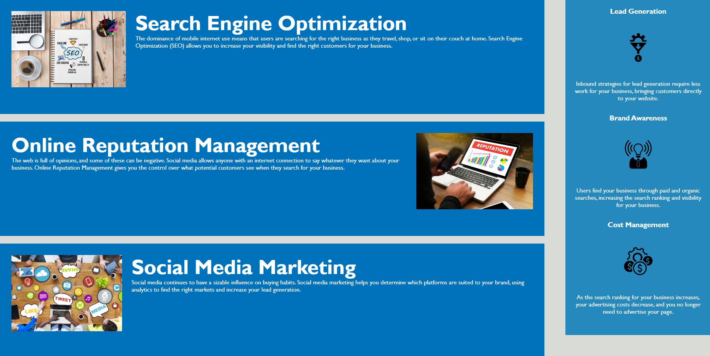

# Horiseon Webpage

Here is the deployed website link: 
https://ngalvin1991.github.io/Horiseon-Webpage/

## Description

The objective of this on-the-job ticket task was to modify the starter code provided to allow for better accessibility to the Horiseon web page. 
This task was performed to make the site more accessible, whether that be through search engines and also allows for people with disabilities to access the page using technology such as screen readers or braille keyboards. 
The task was to meet certain accessibility standards using Semantic HTML elements, image and icon alt attributes, and making sure both HTML and CSS follow each other throughout while keeping the layout and design of the website the same. 

## Installation

N/A

## Usage

In the code provided at the start of the project, within the Navigation Bar the 'Search Engine Optimization' link was unaccessible. This was changed by using the following code: 
> section id="search-engine-optimization" class="content-seo-opm-smm"

As you can see an id tag was inputted which linked this section to the navigation bar. 

An example of an alt tag being added to an  generates a description of the image for persons with disabilities or accessability issues:
> alt="A notepad with a SEO Mind Mapping diagram presented on it. Coffee, pens and a laptop surround the notepad"

As you can see from the screenshot below, the layout and design remains the same.

                

## Credits

Here are some useful links that assisted the completion of this project: 

https://developer.mozilla.org/en-US/docs/Web/CSS
https://developer.mozilla.org/en-US/docs/Glossary/Semantics

## License

GNU GENERAL PUBLIC LICENSE, Version 3, 29 June 2007
